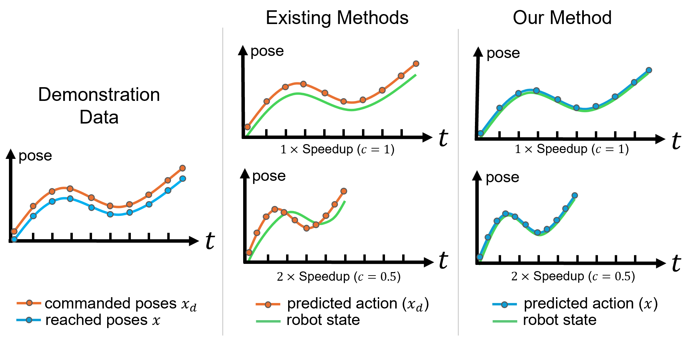

        <!-- controller level -->
        

          

            <h2 class="title is-4">Controller Level</h2>
            

              <!-- challenge3 controller behavior shift-->
              

                

                  

                  <strong>Challenge 3: Controller Behavior Shift</strong> IL policy is commonly trained on commanded pose and deployed with low-gain controller.
                  However, the controller behavior may shift during high-speed execution. We propose to train policy using reached pose and leverage high-fidelity controller to track the trajectory precisely.
                

                

                  
                

              

            

            <!--/ challenge3 controller behavior shift-->

            <!-- challenge4 action scheduling-->
            

              

                

                  <strong>Challenge 4: System Latency in Control Loop</strong>  System latencies caused by communication and control loop can lead to out-of-distribution inputs to the policy and time-misaligned action commands to the controller.
                  To address this, we propose a novel action scheduling mechanism to handle real-world system latencies.
                

                

                
                

              

            

            <!--/ challenge4 action scheduling-->
          

        

        <!--/ controller level -->

<!-- <section class="section">
  

    

      

        

          <h2 class="title is-3">SAIL System Overview</h2>
          

            Placeholder 1.
          

          <video id="dollyzoom" autoplay controls muted loop playsinline height="100%">
            <source src="./static/videos/dollyzoom-stacked.mp4"
                    type="video/mp4"> -->
                    <h2>Placeholder 1 Video</h2>
                  </video>
                

              

              <!--/ Visual Effects. -->
        
              <!-- Matting. -->
              

                <h2 class="title is-3">Placeholder 2</h2>
                

                  

                    

                      Placeholder 2ljkljlkjljkl.
                    

                    <video id="matting-video" controls playsinline height="100%">
                      <!-- <source src="./static/videos/matting.mp4"
                              type="video/mp4"> -->
                      <h2>Placeholder 2 Video</h2>
                    </video>
                  

        
                

              

            

            <!--/ Matting. -->
        
            <!-- Animation. -->
            

              

                <h2 class="title is-3">SAIL System Components Overview</h2>
        
                <!-- Interpolating. -->
                <h3 class="title is-4">Placeholder 4</h3>
                

                  

                    Placeholder 4.
                  

                

                <!-- 

                  

                    
                    
Start Frame

                  

                  

                    

                      Loading...
                    

                    <input class="slider is-fullwidth is-large is-info"
                           id="interpolation-slider"
                           step="1" min="0" max="100" value="0" type="range">
                  

                  

                    
                    
End Frame

                  

                
 -->
                 
                <!--/ Interpolating. -->
        
                <!-- Re-rendering. -->
                <h3 class="title is-4">Placeholder 5</h3>
                

                  

                    Placeholder 5.
                  

                

                

                  <video id="replay-video"
                         controls
                         muted
                         preload
                         playsinline
                         width="75%">
                    <!-- <source src="./static/videos/replay.mp4"
                            type="video/mp4"> -->
                    <h2>Placeholder 5 Video</h2>
                  </video>
                

                <!--/ Re-rendering. -->
        
              

            

            <!--/ Animation. -->
        
          

        </section>
        